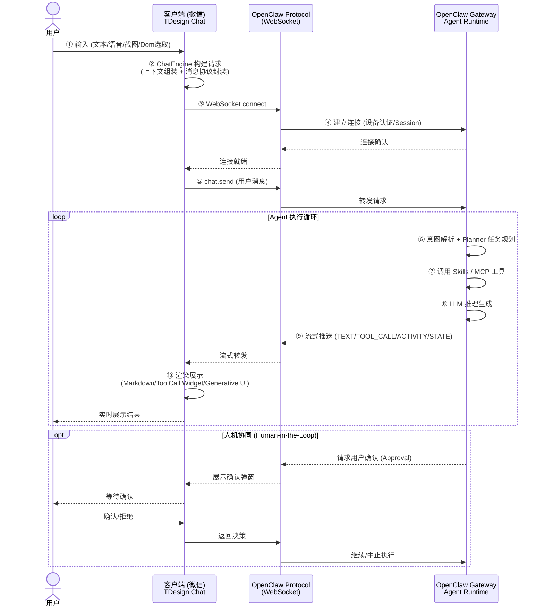
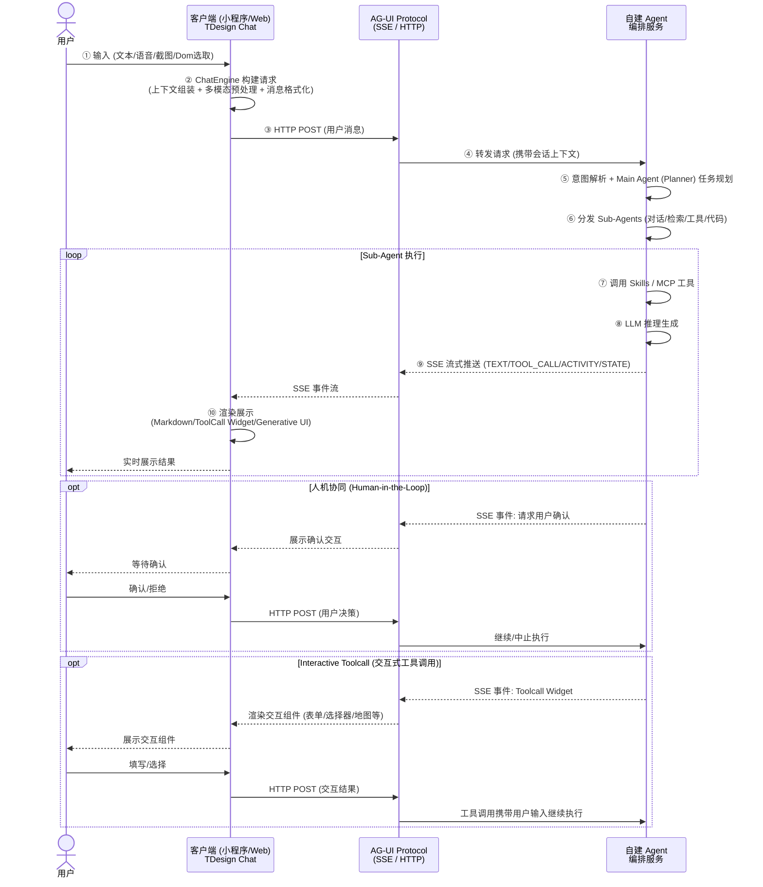

# Agentic 应用全景架构图

```
┌─────────────────────────────────────────────────────────────────────────────────────────────────────┐
│                                        Agent 应用层                                                 │
│  ┌──────────────┐  ┌──────────────┐  ┌──────────────┐  ┌──────────────┐  ┌──────────────┐          │
│  │ 剧本创作助手 │  │   剧本医生   │  │   智能问答   │  │ 指标释义助手 │  │     ...      │          │
│  └──────────────┘  └──────────────┘  └──────────────┘  └──────────────┘  └──────────────┘          │
├─────────────────────────────────────────────────────────────────────────────────────────────────────┤
│                                                                                                     │
│  ┌────────────────────┐  ┌──────────────────────────────────────────────────────────────────────┐   │
│  │     用户输入        │  │                     智能交互基建 (TDesign Chat)                      │   │
│  │  ┌──────┬───────┐  │  │                                                                      │   │
│  │  │文本框│上传   │  │  │  ┌──────────┐ ┌──────────┐  ┌────────────────┐ ┌──────────────────┐  │   │
│  │  │/语音 │附件   │  │  │  │ Copilot  │ │ Chatbot  │  │ScreenSensor   │ │ ChatEngine       │  │   │
│  │  ├──────┼───────┤  │  │  └──────────┘ └──────────┘  │感知引擎       │ │对话引擎          │  │   │
│  │  │绘制  │Dom    │  │  │  ┌──────────┐ ┌──────────┐  │(Dom/OCR)      │ │(FSM/SSE/Toolcall)│  │   │
│  │  │标记  │点选   │  │  │  │SmartCanvas│ │PopBubble │  └────────────────┘ └──────────────────┘  │   │
│  │  ├──────┼───────┤  │  │  └──────────┘ └──────────┘                                           │   │
│  │  │拖拽  │截图   │  │  │  ┌──────────────────────────────────────────────────────────────────┐ │   │
│  │  │框选  │       │  │  │  │                     跨框架适配层                                  │ │   │
│  │  └──────┴───────┘  │  │  │ ┌────────────────┐  ┌─────────────────┐  ┌─────────────────────┐│ │   │
│  │                     │  │  │ │MediaProcessor  │  │ Render 渲染引擎 │  │ Generative UI      ││ │   │
│  │ 用户意图+页面语义   │  │  │ │媒体处理        │  │ (Toolcall Widget│  │ (json-render/A2UI) ││ │   │
│  │ +视觉信息           │  │  │ │(Md/Image/Video)│  │  /Atomic)       │  │                    ││ │   │
│  │                     │  │  │ └────────────────┘  └─────────────────┘  └─────────────────────┘│ │   │
│  └────────────────────┘  │  └──────────────────────────────────────────────────────────────────┘ │   │
│                           │  ┌───────────┐ ┌──────────────────┐ ┌─────────────┐ ┌────────────┐  │   │
│                           │  │Ruying     │ │TDesign AIGC Comps│ │Autotracker  │ │ WebAI SDK  │  │   │
│                           │  │Widgets    │ │                  │ │SDK          │ │            │  │   │
│                           │  └───────────┘ └──────────────────┘ └─────────────┘ └────────────┘  │   │
│                           └──────────────────────────────────────────────────────────────────────┘   │
├═════════════════════════════════════════════════════════════════════════════════════════════════════╡
│                             协议适配层 (Protocol Adapters)                                          │
│                                                                                                     │
│  ┌────────────────────┐  ┌────────────────────┐  ┌────────────────────┐  ┌──────────────────┐     │
│  │  AG-UI Protocol    │  │  OpenClaw Protocol │  │  上下文构建器        │  │  多模态解析器    │     │
│  │  (SSE / HTTP)      │  │  (WebSocket / RPC) │  │  (会话/用户/项目)    │  │  (文本/图片/语音)│     │
│  └─────────┬──────────┘  └─────────┬──────────┘  └────────────────────┘  └──────────────────┘     │
│            │                       │                                                               │
╞════════════╪═══════════════════════╪═══════════════════════════════════════════════════════════════╡
│            ▼                       ▼                                                               │
│  ┌─────────────────────────────────────────────────────────────────────────────────────────────┐    │
│  │                     后端 Agent 运行时 (灵活可选, 独立或组合接入)                             │    │
│  │                                                                                             │    │
│  │  ┌─────────────────────────────────────┐   ┌────────────────────────────────────────────┐   │    │
│  │  │       OpenClaw Gateway              │   │       自建 Agent 编排服务                   │   │    │
│  │  │       开箱即用 · 快速验证              │   │       深度定制 · 复杂编排                   │   │    │
│  │  │                                     │   │                                            │   │    │
│  │  │  · Gateway Server                   │   │  ┌─────────────┐  ┌─────────────────────┐  │   │    │
│  │  │  · Session / Channel 管理            │   │  │ Main Agent  │  │ Sub-Agents          │  │   │    │
│  │  │  · Agent Runtime (内置)              │   │  │ (Planner)   │─▶│ 对话│检索│工具│代码    │  │   │    │
│  │  │  · Browser Control                  │   │  └─────────────┘  └─────────────────────┘  │   │    │
│  │  │  · 设备认证 / 健康检测                 │   │  ┌─────────────┐  ┌─────────────────────┐  │   │    │
│  │  │                                     │   │  │ 提示词管理    │  │ 模型路由(多模型切换)   │  │   │    │
│  │  │                                     │   │  └─────────────┘  └─────────────────────┘  │   │    │
│  │  └─────────────────────────────────────┘   └────────────────────────────────────────────┘   │    │
│  │                                                                                             │    │
│  │  ┌─────────────────────────────────────────────────────────────────────────────────────┐    │    │
│  │  │                       公共能力 (各运行时共享)                                           │    │    │
│  │  │   对话管理 (会话状态/历史/记忆压缩)  │  人机协同 (Approval/Interactive Toolcall)          │    │    │
│  │  └─────────────────────────────────────────────────────────────────────────────────────┘    │    │
│  └─────────────────────────────────────────────────────────────────────────────────────────────┘    │
│                                                                                                     │
│  ┌─────────────────────────────────────────────────────────────────────────────────────────────┐    │
│  │                    Event Bus & 异步任务队列 (支持离线/驻留 Agent)                             │    │
│  │                                                                                             │    │
│  │  ┌──────────────────┐  ┌──────────────────┐  ┌──────────────────┐  ┌──────────────────┐    │    │
│  │  │  事件总线         │  │  任务调度器         │  │  定时/Cron 触发  │  │  Agent 驻留管理  │    │    │
│  │  │  (Pub/Sub)       │  │  (优先级队列)      │  │  (周期任务)      │  │  (后台长驻Agent) │    │    │
│  │  └──────────────────┘  └──────────────────┘  └──────────────────┘  └──────────────────┘    │    │
│  └─────────────────────────────────────────────────────────────────────────────────────────────┘    │
│                                          │                                                          │
│                                          ▼                                                          │
├═════════════════════════════════════════════════════════════════════════════════════════════════════╡
│                                    能力池 (Skills & MCP)                                             │
│                                                                                                     │
│  ┌──────────────────────────────────────────┐  ┌──────────────────────────────────────────────┐    │
│  │            Skills 池 (内置能力)           │  │              MCP 池 (外部工具)                 │    │
│  │                                          │  │                                              │    │
│  │  ┌────────┐             ┌────────┐       │  │  ┌──────────┐ ┌──────────┐ ┌──────────┐       │    │
│  │  │ 文件   │             │ 网页   │       │  │  │ GitHub   │ │ Jira     │ │ Slack    │       │    │
│  │  │ 读写   │             │ 搜索   │       │  │  │ Server   │ │ Server   │ │ Server   │       │    │
│  │  └────────┘             └────────┘       │  │  └──────────┘ └──────────┘ └──────────┘       │    │
│  │  ┌────────┐ ┌────────┐  ┌────────┐      │  │  ┌──────────┐ ┌──────────┐ ┌──────────┐       │    │
│  │  │ 数据库 │ │ 图片   │  │ 邮件   │      │  │  │ 数据库   │ │ 监控     │ │ 日历     │       │    │
│  │  │ 查询   │ │ 生成   │  │ 收发   │      │  │  │ MCP      │ │ MCP      │ │ MCP      │       │    │
│  │  └────────┘ └────────┘  └────────┘      │  │  └──────────┘ └──────────┘ └──────────┘       │    │
│  │  ┌────────┐ ┌────────┐                   │  │  ┌──────────┐ ┌──────────┐ ┌──────────┐       │    │
│  │  │ 日程   │ │ 截屏   │                   │  │  │ Figma    │ │ Notion   │ │ 自定义   │       │    │
│  │  │ 管理   │ │ 录屏   │                   │  │  │ MCP      │ │ MCP      │ │ MCP ...  │       │    │
│  │  └────────┘ └────────┘                   │  │  └──────────┘ └──────────┘ └──────────┘       │    │
│  │                                          │  │                                              │    │
│  │  ┌╌╌╌╌╌╌╌╌╌╌╌╌╌╌╌╌╌╌╌╌╌╌╌╌╌╌╌╌╌╌╌╌╌┐  │  │  ┌─────────────────────────────────────────┐ │    │
│  │  ┊  🔒 隔离执行沙箱 (Sandbox / E2B) ┊  │  │  │ MCP Protocol (stdio / SSE / Streamable) │ │    │
│  │  ┊                                   ┊  │  │  │ Tool / Resource / Prompt / Sampling    │ │    │
│  │  ┊  ┌────────┐  ┌────────┐           ┊  │  │  └─────────────────────────────────────────┘ │    │
│  │  ┊  │ 代码   │  │ Shell  │           ┊  │  │                                              │    │
│  │  ┊  │ 执行   │  │ 命令   │           ┊  │  │                                              │    │
│  │  ┊  └────────┘  └────────┘           ┊  │  │                                              │    │
│  │  ┊  · 容器级隔离 · 资源配额限制          ┊  │  │                                              │    │
│  │  ┊  · 网络策略管控 · 超时自动回收        ┊  │  │                                              │    │
│  │  └╌╌╌╌╌╌╌╌╌╌╌╌╌╌╌╌╌╌╌╌╌╌╌╌╌╌╌╌╌╌╌╌╌┘  │  │                                              │    │
│  │                                          │  │                                              │    │
│  │  ┌─────────────────────────────────────┐ │  │                                              │    │
│  │  │ group:fs │ group:runtime │ exec     │ │  │                                              │    │
│  │  │  文件组  │    运行时组   │ 执行器   │ │  │                                              │    │
│  │  └─────────────────────────────────────┘ │  │                                              │    │
│  └──────────────────────────────────────────┘  └──────────────────────────────────────────────┘    │
│                                                                                                     │
├═════════════════════════════════════════════════════════════════════════════════════════════════════╡
│                                       基础设施层                                                    │
│                                                                                                     │
│  ┌────────────┐ ┌────────────┐ ┌──────────────────┐ ┌──────────────┐ ┌────────────┐ ┌──────────┐ │
│  │ 知识库     │ │ 模型网关   │ │  记忆存储        │ │ 提示词存储   │ │ 链路/指标  │ │ 审计日志 │ │
│  │ (RAG/向量) │ │(Venus/多源)│ │  · 会话短期记忆  │ │              │ │ 存储       │ │          │ │
│  │            │ │            │ │  · 用户长期记忆  │ │              │ │            │ │          │ │
│  │            │ │            │ │  · 实体/关系图谱 │ │              │ │            │ │          │ │
│  └────────────┘ └────────────┘ └──────────────────┘ └──────────────┘ └────────────┘ └──────────┘ │
│                                                                                                     │
│  ┌──────────────────────────────────────────────────────────────────────────────────────────────┐  │
│  │                       Prompt 安全防线 (模型网关前置)                                          │  │
│  │  Prompt 注入检测 │ 敏感词过滤 │ PII 脱敏 │ 越权指令拦截 │ 输出合规校验                       │  │
│  └──────────────────────────────────────────────────────────────────────────────────────────────┘  │
│                                                                                                     │
│  ┌──────────────────────────────────────────────────────────────────────────────────────────────┐  │
│  │                                       LLM 模型层                                             │  │
│  │  ┌──────────┐  ┌──────────┐  ┌──────────┐  ┌──────────┐  ┌──────────┐  ┌──────────┐        │  │
│  │  │ GPT-4o   │  │ Claude   │  │ Gemini   │  │ DeepSeek │  │ Kimi     │  │ 混元     │  ...   │  │
│  │  └──────────┘  └──────────┘  └──────────┘  └──────────┘  └──────────┘  └──────────┘        │  │
│  └──────────────────────────────────────────────────────────────────────────────────────────────┘  │
│                                                                                                     │
├═════════════════════════════════════════════════════════════════════════════════════════════════════╡
│                                  公共组件 (贯穿全链路)                                              │
│                                                                                                     │
│  ┌────────────┐  ┌────────────┐  ┌────────────┐  ┌────────────┐  ┌────────────┐                   │
│  │   RBAC     │  │   Trace    │  │   Audit    │  │   多租户   │  │  实验管理  │                   │
│  │  权限控制  │  │  链路追踪  │  │  审计日志  │  │   隔离     │  │  A/B Test  │                   │
│  └────────────┘  └────────────┘  └────────────┘  └────────────┘  └────────────┘                   │
│                                                                                                     │
│  ┌──────────────────────────────────────┐  ┌──────────────────────────────────────────────────┐    │
│  │  AgentOps / Evals (评测闭环)         │  │  AI Guardrails (安全护栏)                         │    │
│  │                                      │  │                                                  │    │
│  │  · Agent 行为追踪 & 可观测           │  │  · 输入/输出内容安全检测                          │    │
│  │  · 自动化评测 (Benchmark/回归)       │  │  · 幻觉检测 & 事实性校验                          │    │
│  │  · 质量打分 & 人工标注               │  │  · 合规策略引擎 (政策/行业规范)                    │    │
│  │  · 评测数据集管理 & A/B 对比         │  │  · 异常行为熔断 (Token/频率/权限)                  │    │
│  └──────────────────────────────────────┘  └──────────────────────────────────────────────────┘    │
│                                                                                                     │
└─────────────────────────────────────────────────────────────────────────────────────────────────────┘
```

## 数据流说明

### 场景一：OpenClaw 协议 (微信等端)



### 场景二：自建 Agent 编排服务 (小程序 / Web)



## 关键设计点

1. **前端统一入口**：TDesign Chat (ChatEngine) 作为唯一前端引擎，通过协议适配器屏蔽后端差异
2. **双协议支持**：AG-UI (SSE/HTTP) 和 OpenClaw (WebSocket) 并行，通过适配器屏蔽差异
3. **后端灵活可选**：OpenClaw Gateway 开箱即用，自建编排服务深度定制，各自独立接入，按场景轻重自由选择
4. **能力池化**：Skills (内置能力) + MCP (外部工具) 统一注册、按需调用，任何运行时均可接入
5. **流式全链路**：从 LLM 推理到前端渲染，全程流式传输，支持增量更新
6. **沙箱隔离**：代码执行、Shell 命令等高风险操作在隔离沙箱 (Sandbox/E2B) 中运行，容器级隔离 + 资源配额 + 网络管控 + 超时回收
7. **安全纵深防御**：Prompt 注入检测 → 敏感词/PII 过滤 → AI Guardrails (输入输出安全检测 + 幻觉校验 + 合规策略 + 异常熔断)，贯穿请求全生命周期
8. **精细化记忆**：会话短期记忆 → 用户长期记忆 → 实体/关系图谱，支持记忆压缩与按需召回
9. **评测闭环**：AgentOps 行为追踪 + 自动化评测 (Benchmark/回归) + 质量打分 + A/B 对比，驱动持续优化
10. **异步 & 驻留**：Event Bus + 异步任务队列支持离线驻留 Agent，定时触发、后台长驻、优先级调度
